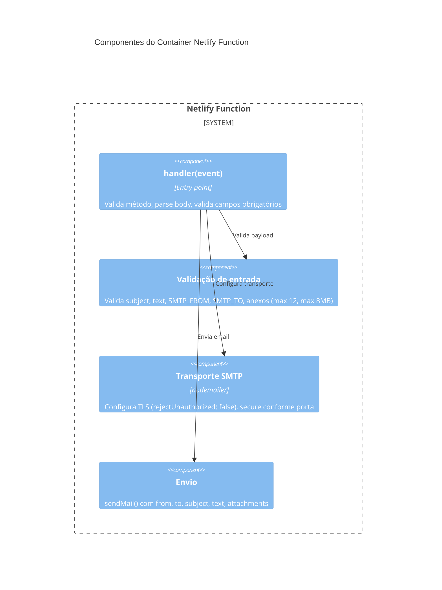

# C4 — Diagrama de Componentes (Nível 3)

> Gerado pelo Arquiteto em 2026-06-15

---

## Container: SPA

```mermaid
C4Component
  title Componentes do Container SPA — mail-mvp

  Person(tecnico, "Técnico de Campo")

  System_Boundary(spa, "SPA") {
    Component(app, "app.js", "Entry point", "Inicialização, event delegation global, orquestração")
    Component(dom, "dom.js", "Cache DOM", "Singleton com referências a todos os elementos da UI")
    Component(iniciais, "iniciais.js", "Formulário Início", "Renderização dinâmica dos 12 campos iniciais + coordinates")
    Component(retornos, "retornos.js", "Formulário Retorno", "Renderização condicional de campos por tipo de ordem")
    Component(fields, "fields.js", "Definição de Campos", "Schema de 41 tipos de ordem + campos de início")
    Component(validation, "validation.js", "Validação", "5 validadores (Strategy Pattern), cache, blur validation")
    Component(email, "email.js", "Composição Email", "Montagem do corpo do email + live preview")
    Component(send, "send.js", "Envio Email", "Orquestração: valida → duplicata → comprime → envia")
    Component(attachments, "attachments.js", "Upload Anexos", "Upload, preview grid, lightbox, remoção")
    Component(compress, "compress.js", "Compressão", "Compressão progressiva de imagens (JPEG, canvas)")
    Component(equipment, "equipment.js", "Equipamentos", "CRUD in-memory de equipamentos")
    Component(persistence, "persistence.js", "Persistência", "Save/restore do estado completo")
    Component(db, "db.js", "IndexedDB", "CRUD atômico em 2 stores (records + attachments)")
    Component(restore, "restore.js", "Restore", "Aplicação de registro ao formulário")
    Component(state, "state.js", "Estado Global", "Singleton de estado reativo")
    Component(storage, "storage.js", "localStorage", "Intermediário para quebrar ciclo de import")
    Component(sidebar, "sidebar.js", "Sidebar", "Histórico com filtro e ações (editar/excluir)")
    Component(duplicate, "duplicate.js", "Duplicata", "Prevenção de reenvio acidental")
    Component(ui, "ui.js", "UI Helpers", "Toast, error bar, modais de confirmação")
    Component(utils, "utils.js", "Utilitários", "Base64, coordenadas, formato de data")
    Component(reset, "reset.js", "Reset", "Reset completo do formulário")
    Component(swupdate, "sw-update.js", "SW Update", "Gerenciamento de atualização do Service Worker")
    Component(styles, "styles.js", "Constantes CSS", "Classes CSS compartilhadas entre módulos")
  }

  Rel(tecnico, app, "Interage")
  Rel(app, dom, "Cacheia elementos")
  Rel(app, iniciais, "Renderiza seção 1")
  Rel(app, retornos, "Renderiza seção 2 via tipoChange")
  Rel(app, send, "Orquestra envio")
  Rel(app, validation, "Valida formulário")
  Rel(app, attachments, "Gerencia upload")
  Rel(app, equipment, "Gerencia equipamentos")
  Rel(app, persistence, "Persiste estado")
  Rel(app, sidebar, "Exibe histórico")
  Rel(app, duplicate, "Verifica duplicata")
  Rel(app, email, "Live preview e composição")

  Rel(send, validation, "Valida antes de enviar")
  Rel(send, duplicate, "Verifica duplicata")
  Rel(send, compress, "Comprime imagens")
  Rel(send, db, "Atualiza status para sent")

  Rel(retornos, fields, "Obtém campos por tipo")
  Rel(validation, iniciais, "Lê dados do DOM")
  Rel(validation, retornos, "Lê dados de retorno")
  Rel(validation, equipment, "Coleta equipamentos")

  Rel(persistence, db, "Salva/restaura records")
  Rel(persistence, storage, "Persiste UUID")
  Rel(restore, db, "Busca anexos")
  Rel(restore, attachments, "Re-renderiza previews")
  Rel(sidebar, db, "Lista todos registros")
```

## Responsabilidades dos Componentes

| Componente | Responsabilidade | Dependências |
|-----------|-----------------|-------------|
| **app.js** | Entry point. Inicializa tudo no DOMContentLoaded. Event delegation global. | Todos os módulos |
| **dom.js** | Cache DOM: ~25 referências a elementos da UI. Nunca chamar getElementById fora daqui. | — |
| **iniciais.js** | Renderiza 12 campos iniciais. INPUT_CREATORS (factory). getIniciaisData(). | dom, fields, validation |
| **retornos.js** | Renderiza campos por tipo de ordem. Sistema de condicionais em cascata. | dom, fields, state |
| **fields.js** | Schema: iniciaisFields + retornoFieldsByTipo (41 tipos). getRetornoFields(). | — |
| **validation.js** | 5 validadores (SECTION_VALIDATORS). Cache _validatedData[n]. Blur validation. | dom, state, iniciais, retornos |
| **email.js** | composeEmail() em texto plano. normalizeText (acentos→maiúsculas). Live preview. | dom, state, fields |
| **send.js** | sendEmail(): valida → duplicata → comprime → fetch → atualiza status. | Todos os módulos principais |
| **attachments.js** | Upload (max 12), preview grid, lightbox, removeFile. | state, ui |
| **compress.js** | Compressão progressiva: canvas + JPEG, max 10 tentativas, fallback qualidade 0.7 | utils |
| **equipment.js** | addEquip(), remove, collectEquipamentos(), renderEquipamentos(). | state, persistence |
| **persistence.js** | saveState(), debouncedSave(), dirty tracking de anexos. | state, storage, db |
| **db.js** | IndexedDB CRUD v3: saveDraft, getRecord, getAllRecords, deleteRecord (atômico), updateRecordStatus, saveAttachments | — |
| **restore.js** | applyRecord(): restaura formulário completo com migração v2→v3. | state, fields, attachments |
| **state.js** | Estado global: iniciais, equipamentos, attachments, retorno, currentUUID. Re-exporta funções de persistence. | storage, persistence |
| **storage.js** | getRawUUID(), storeUUID(), removeUUID(). Quebra ciclo state→persistence→state. | localStorage |
| **sidebar.js** | renderSidebar(filter?), loadRecord(), closeSidebar(). | db, restore |
| **duplicate.js** | checkDuplicate(): Promise com modal de confirmação se status=sent. | db, state |
| **ui.js** | showToast(), showError(), setFieldError(), showConfirm(). | dom |
| **utils.js** | toBase64(), blobToBase64(), loadImage(), formatDate(), captureCoordinates(). | — |
| **reset.js** | resetForm(): zera state, re-renderiza seções, limpa UUID. | state, iniciais, retornos |
| **sw-update.js** | initSW(): registra SW, monitora controllerchange → modal → reload. | dom, ui |
| **styles.js** | INPUT_CLASS, SELECT_CLASS. Constantes CSS. | — |

## Container: Netlify Function

---

*Fim do diagrama de componentes.*
