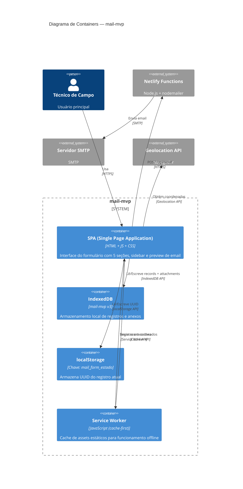

# C4 — Diagrama de Containers (Nível 2)

> Gerado pelo Arquiteto em 2026-06-15

---

## Diagrama

## Containers

| Container | Tecnologia | Descrição | Persistência |
|-----------|-----------|-----------|-------------|
| **SPA** | HTML5 + CSS3 + Vanilla JS (ES6 modules) | Interface completa com formulário dinâmico, sidebar de histórico, preview de email, upload de anexos | — |
| **IndexedDB** | IndexedDB API (navegador) | Banco NoSQL cliente-side com 2 stores: `records` (registros de OS) e `attachments` (anexos separados) | ✅ Sim, local |
| **localStorage** | Web Storage API | Chave `mail_form_estado` com UUID do registro atual (ponte entre sessões) | ✅ Sim, local |
| **Service Worker** | Service Worker API | Cache-first para assets estáticos. Gerenciamento de versão via `CACHE_NAME`. Exibe modal ao detectar atualização | Cache |

## Comunicação entre Containers

| Origem | Destino | Protocolo | Dados |
|--------|---------|-----------|-------|
| SPA | IndexedDB | IndexedDB API | JSON (records + attachments) |
| SPA | localStorage | localStorage API | UUID string |
| SPA | Service Worker | Service Worker API | Eventos (install, activate, fetch, message) |
| SPA | Netlify Functions | HTTPS POST | JSON: { subject, text, attachments[] } |
| SPA | Geolocation API | Geolocation API | Coordenadas { lat, lon } |

---

*Fim do diagrama de containers.*
