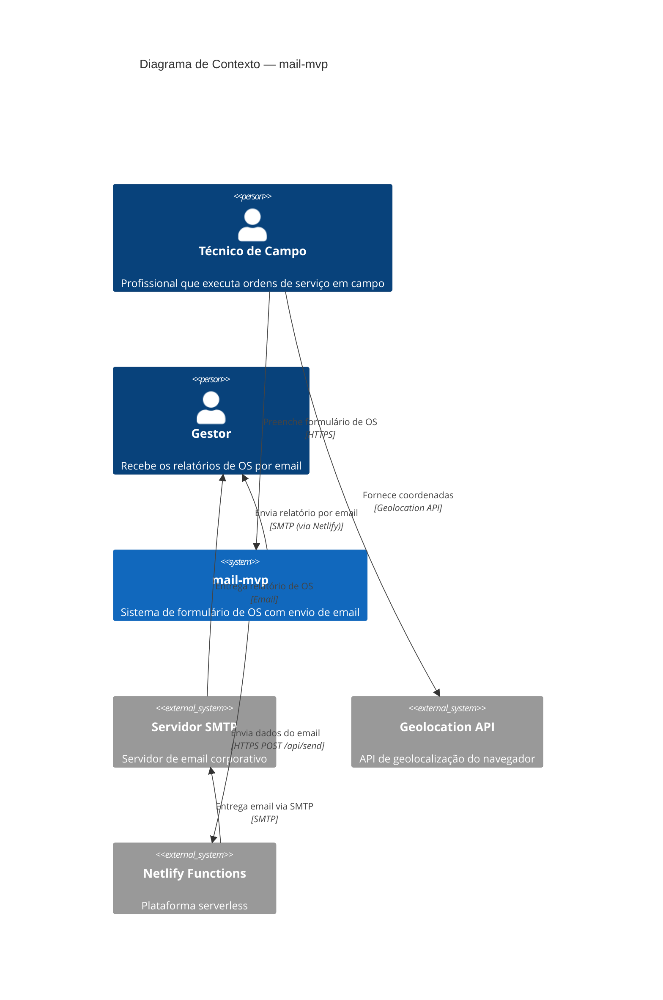

# C4 — Diagrama de Contexto (Nível 1)

> Gerado pelo Arquiteto em 2026-06-15

---

## Diagrama

## Descrição dos Elementos

### Pessoas

| Persona | Descrição |
|---------|-----------|
| **Técnico de Campo** | Usuário principal. Preenche o formulário da OS em campo, anexa fotos e envia o relatório. Usa o app em um dispositivo móvel (offline-first). |
| **Gestor** | Destinatário dos emails. Recebe os relatórios de OS no email corporativo. Não interage diretamente com o sistema. |

### Sistemas

| Sistema | Descrição |
|---------|-----------|
| **mail-mvp** | Sistema SPA PWA que o técnico usa para preencher formulários de OS, anexar imagens e enviar relatórios por email |
| **Servidor SMTP** | Servidor de email corporativo configurado via variáveis de ambiente. Entrega os emails aos destinatários |
| **Geolocation API** | API nativa do navegador que fornece as coordenadas geográficas do técnico |
| **Netlify Functions** | Plataforma serverless que hospeda a função de relay SMTP |

### Relacionamentos

| De | Para | Descrição | Protocolo |
|----|------|-----------|-----------|
| Técnico | mail-mvp | Preenche formulário, anexa arquivos | HTTPS |
| mail-mvp | Netlify Functions | POST com JSON (subject, text, attachments) | HTTPS |
| Netlify Functions | Servidor SMTP | Entrega de email | SMTP |
| Servidor SMTP | Gestor | Email recebido na caixa de entrada | SMTP/POP3/IMAP |

---

*Fim do diagrama de contexto.*
