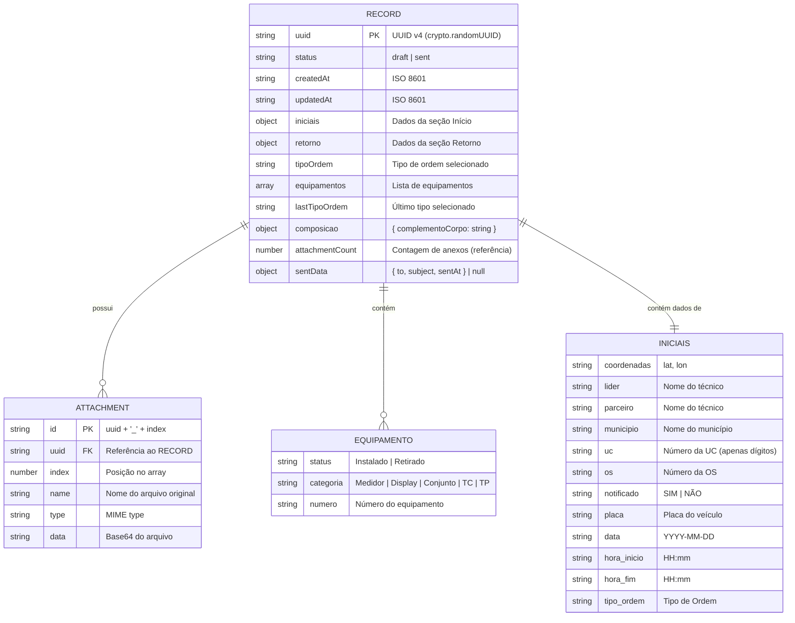

# ERD — Modelo Entidade-Relacionamento

> Gerado pelo Arquiteto em 2026-06-15
> Escala: 🟢 CONFIRMADO | 🟡 INFERIDO | 🔴 LACUNA

---

## Diagrama



## Entidades

### RECORD (`records` store — IndexedDB)

Entidade central. Representa um formulário de OS preenchido.

| Campo | Tipo | PK/FK | Obrigatório | Descrição |
|-------|------|-------|-------------|-----------|
| `uuid` | string | PK | sim | Identificador único. Gerado via `crypto.randomUUID()` com fallback |
| `status` | string | — | sim | Estado do registro: `draft` (rascunho) ou `sent` (enviado) |
| `createdAt` | string | — | sim | ISO 8601 da criação |
| `updatedAt` | string | — | sim | ISO 8601 da última atualização |
| `iniciais` | object | — | sim | Objeto com valores dos campos de início |
| `retorno` | object | — | não | Objeto com valores dos campos de retorno |
| `tipoOrdem` | string | — | não | Nome do tipo de ordem selecionado |
| `lastTipoOrdem` | string | — | não | Último tipo para detectar mudança |
| `equipamentos` | array | — | não | Lista de objetos equipamento |
| `composicao` | object | — | não | `{ complementoCorpo: string }` |
| `attachmentCount` | number | — | não | Contagem de anexos (referência) |
| `sentData` | object? | — | não | Dados do envio: `{ to, subject, sentAt }` |

> **Cardinalidade**: 1 RECORD pode ter 0..N ATTACHMENTS, 0..N EQUIPAMENTOS, 1 INICIAIS (embutido)

### ATTACHMENT (`attachments` store — IndexedDB)

Anexos do formulário (imagens). Store separado desde a versão v3 do banco.

| Campo | Tipo | PK/FK | Obrigatório | Descrição |
|-------|------|-------|-------------|-----------|
| `id` | string | PK | sim | Chave composta: `{uuid}_{index}` |
| `uuid` | string | FK | sim | Referência ao RECORD. Indexado (non-unique) |
| `index` | number | — | sim | Posição ordinal no array de anexos |
| `name` | string | — | sim | Nome original do arquivo (ex: "foto_medidor.jpg") |
| `type` | string | — | sim | MIME type (ex: "image/jpeg") |
| `data` | string | — | sim | Conteúdo em Base64 (sem header `data:`) |

> **Cardinalidade**: N ATTACHMENTS pertencem a 1 RECORD

### EQUIPAMENTO (embutido em `state.equipamentos[]`)

Equipamentos instalados ou retirados durante a OS. Armazenados como array dentro do RECORD.

| Campo | Tipo | Obrigatório | Domínio |
|-------|------|-------------|---------|
| `status` | string | sim | `Instalado` ou `Retirado` |
| `categoria` | string | sim | `Medidor`, `Display`, `Conjunto`, `TC`, `TP` |
| `numero` | string | sim | Número do equipamento (string para preservar zeros à esquerda) |

> **Cardinalidade**: N EQUIPAMENTOS pertencem a 1 RECORD

### INICIAIS (embutido em `state.iniciais`)

Dados da seção "Início" do formulário. Armazenados como objeto dentro do RECORD.

| Campo | Tipo | Obrigatório | Domínio |
|-------|------|-------------|---------|
| `coordenadas` | string | não | "lat, lon" ou "Não disponível" |
| `lider` | string | sim | Nome do técnico líder (12 opções) |
| `parceiro` | string | sim | Nome do técnico parceiro (12 opções) |
| `municipio` | string | sim | Município (29 opções do CE) |
| `uc` | string | sim | UC (apenas dígitos, armazenado como string) |
| `os` | string | sim | OS (texto livre) |
| `notificado` | string | sim | "SIM" ou "NÃO" |
| `placa` | string | sim | Placa do veículo (12 opções) |
| `data` | string | sim | Data ISO: "YYYY-MM-DD" |
| `hora_inicio` | string | sim | "HH:mm" |
| `hora_fim` | string | sim | "HH:mm" |
| `tipo-ordem` | string | sim | Tipo de ordem (41 opções) |

> **Cardinalidade**: 1 INICIAIS pertence a 1 RECORD (1:1)

### RETORNO (embutido em `state.retorno`)

Campos dinâmicos da seção "Retorno", que variam conforme o tipo de ordem. Estrutura flexível (chave-valor).

> **Cardinalidade**: 1 RETORNO pertence a 1 RECORD (1:1, pode ser vazio)

---

## Relacionamentos Resumidos

```
RECORD 1 ──1── INICIAIS      (embutido)
RECORD 1 ──1── RETORNO       (embutido, opcional)
RECORD 1 ──N── EQUIPAMENTO   (embutido, array)
RECORD 1 ──N── ATTACHMENT    (store separado, FK = uuid)
```

---

## Histórico de Migrações

| Versão | Mudança |
|--------|---------|
| v1 | Criação inicial: store `records` com anexos inline + store `sent_emails` |
| v2 | Remoção do store `sent_emails` |
| v3 | Separação de anexos para store `attachments`. Registros v2 são migrados transparentemente no restore |

---

*Fim do ERD.*
