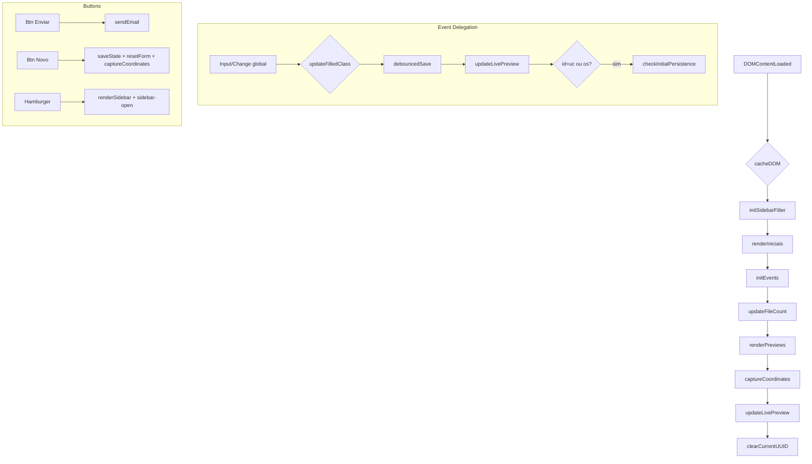
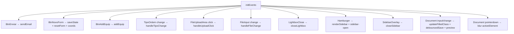

# Fluxograma — App: Inicialização

```mermaid
flowchart TD
    A[DOMContentLoaded] --> B{cacheDOM}
    B --> C[initSidebarFilter]
    C --> D[renderIniciais]
    D --> E[initEvents]
    E --> F[updateFileCount]
    F --> G[renderPreviews]
    G --> H[captureCoordinates]
    H --> I[updateLivePreview]
    I --> J[clearCurrentUUID]
    
    subgraph "Event Delegation"
        K[Input/Change global] --> L{updateFilledClass}
        L --> M[debouncedSave]
        M --> N[updateLivePreview]
        N --> O{id=uc ou os?}
        O -->|sim| P[checkInitialPersistence]
    end
    
    subgraph "Buttons"
        Q[Btn Enviar] --> R[sendEmail]
        S[Btn Novo] --> T[saveState + resetForm + captureCoordinates]
        U[Hamburger] --> V[renderSidebar + sidebar-open]
    end
```

## Fluxo — initEvents

```mermaid
flowchart TD
    A[initEvents] --> B[BtnEnviar → sendEmail]
    A --> C[BtnNovoForm → saveState + resetForm + coords]
    A --> D[BtnAddEquip → addEquip]
    A --> E[TipoOrdem change → handleTipoChange]
    A --> F[FileUploadArea click → handleUploadClick]
    A --> G[FileInput change → handleFileChange]
    A --> H[LightboxClose → closeLightbox]
    A --> I[Hamburger → renderSidebar + sidebar-open]
    A --> J[SidebarOverlay → closeSidebar]
    A --> K[Document input/change → updateFilledClass + debouncedSave + preview]
    A --> L[Document pointerdown → blur activeElement]
```
