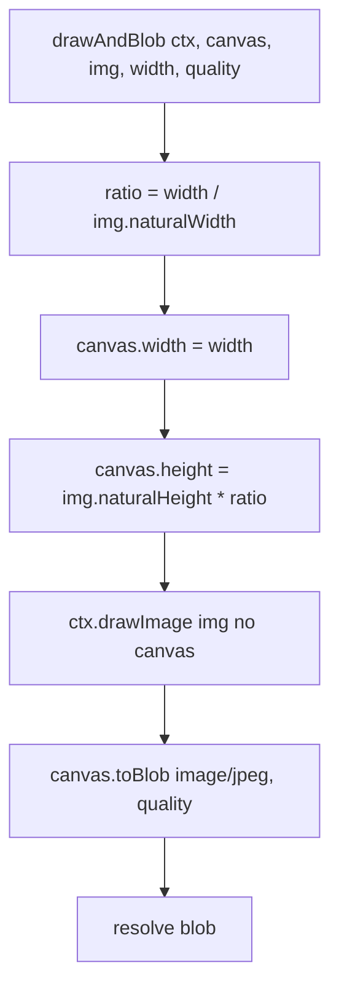

# Fluxograma — Attachments: Compressão Progressiva

```mermaid
flowchart TD
    A[compressAttachments files] --> B[Iterar files]
    B --> C{file.size ≤ SKIP_SIZE<br>ou não é imagem?}
    C -->|sim| D[toBase64 + push direto]
    C -->|não| E[loadImage → canvas]
    E --> F[width = naturalWidth]
    F --> G[tentativa = 0]
    G --> H{tentativa ≤ 10?}
    H -->|sim| I{tentativa === 10?}
    I -->|sim| J[qualidade = 0.7 fallback]
    I -->|não| K[qualidade = 0.9]
    J --> L[drawAndBlob canvas, img, width, quality]
    K --> L
    L --> M{blob.size ≤ MAX_SIZE?}
    M -->|sim| N[push como {filename, content, encoding}]
    M -->|não| O{tentativa < 10?}
    O -->|sim| P[width *= 0.8]
    P --> Q[tentativa++]
    Q --> H
    O -->|não| N
    N --> R[Próximo file]
```

## Detalhe — drawAndBlob


