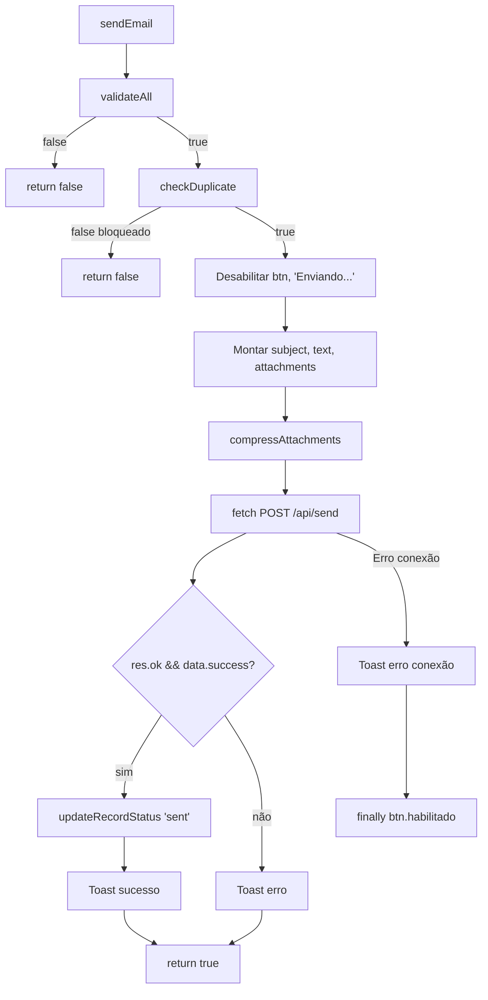
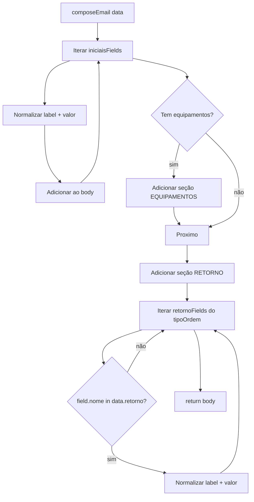

# Fluxograma — Email: Send

```mermaid
flowchart TD
    A[sendEmail] --> B[validateAll]
    B -->|false| C[return false]
    B -->|true| D[checkDuplicate]
    D -->|false bloqueado| E[return false]
    D -->|true| F[Desabilitar btn, 'Enviando...']
    F --> G[Montar subject, text, attachments]
    G --> H[compressAttachments]
    H --> I[fetch POST /api/send]
    I --> J{res.ok && data.success?}
    J -->|sim| K[updateRecordStatus 'sent']
    K --> L[Toast sucesso]
    L --> M[return true]
    J -->|não| N[Toast erro]
    N --> M
    I -->|Erro conexão| O[Toast erro conexão]
    O --> P[finally btn.habilitado]
```

## Fluxo — composeEmail

```mermaid
flowchart TD
    A[composeEmail data] --> B[Iterar iniciaisFields]
    B --> C[Normalizar label + valor]
    C --> D[Adicionar ao body]
    D --> B
    B --> E{Tem equipamentos?}
    E -->|sim| F[Adicionar seção EQUIPAMENTOS]
    F --> G[Proximo]
    E -->|não| G
    G --> H[Adicionar seção RETORNO]
    H --> I[Iterar retornoFields do tipoOrdem]
    I --> J{field.nome in data.retorno?}
    J -->|sim| K[Normalizar label + valor]
    K --> I
    J -->|não| I
    I --> L[return body]
```
