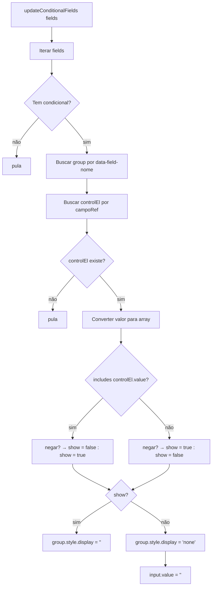
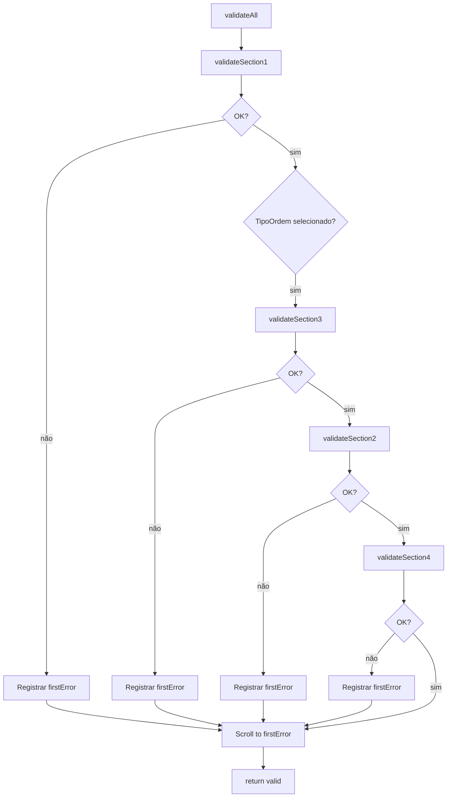

# Fluxograma — Form: Campos Condicionais

```mermaid
flowchart TD
    A[handleTipoChange] --> B{tipo === lastTipoOrdem?}
    B -->|sim| C[return]
    B -->|não| D[state.lastTipoOrdem = tipo]
    D --> E[state.retorno = {}]
    E --> F[renderRetorno]
    F --> G[saveState]

    subgraph "renderRetorno"
        H[getRetornoFields tipo] --> I[agruparPorLinha]
        I --> J[Iterar grupos]
        J --> K[Criar rowDiv flex/mb-4]
        K --> L[Criar group com dataset.fieldNome]
        L --> M{Campo tem condicional?}
        M -->|sim| N[dataset.condicionalRef + dataset.condicionalVal]
        N --> O[group.style.display = none]
        M -->|não| O
        O --> P[Criar label + input + errorSpan]
        P --> Q[input change → updateConditionalFields]
    end
```

## Fluxo — updateConditionalFields



## Fluxo — Validação


