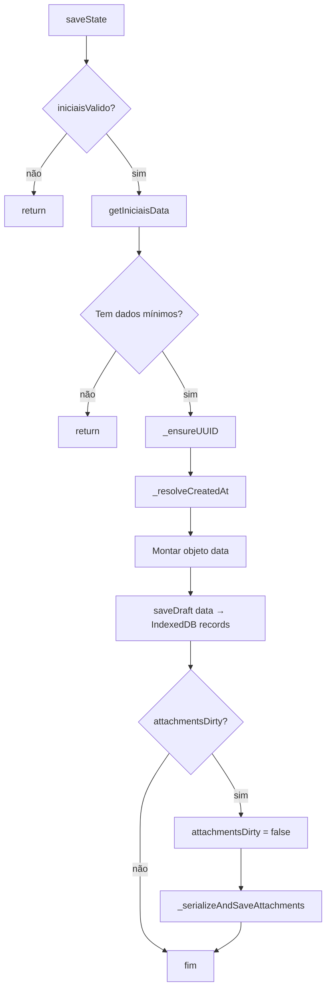
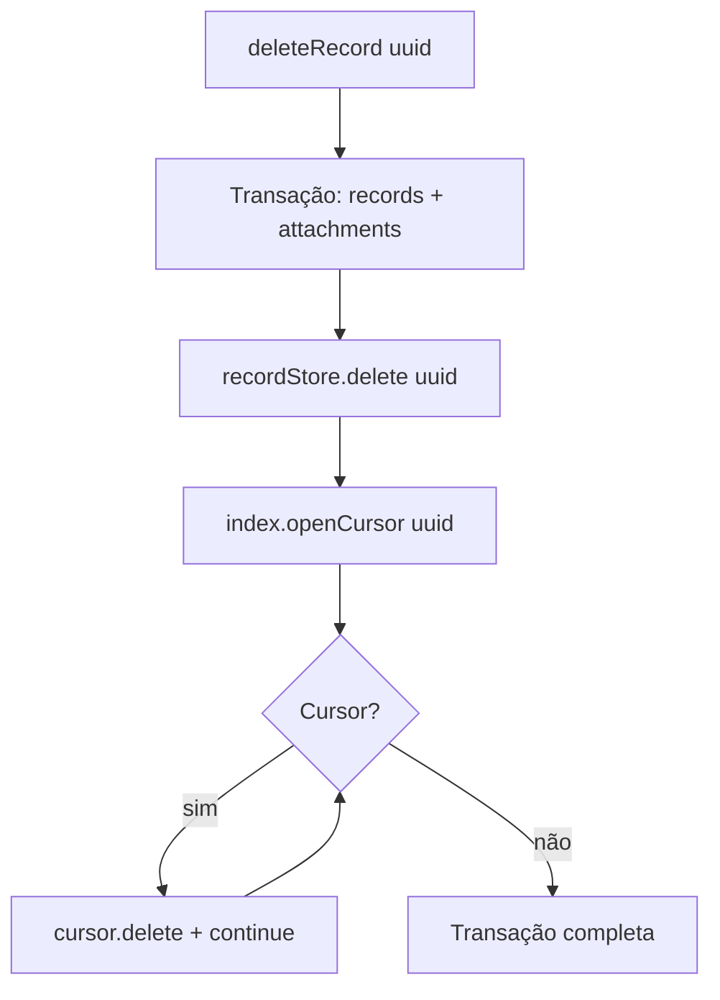

# Fluxograma — Persistence: Save State



## Fluxo — applyRecord (Restore)

```mermaid
flowchart TD
    A[applyRecord record] --> B[setCurrentUUID]
    B --> C[state.iniciaisValido = true]
    C --> D[Restaurar equipamentos, lastTipoOrdem, iniciais, retorno]
    D --> E{record.attachments array?}
    E -->|sim v2| F[Migrar inline → File objects]
    E -->|não| G{attachmentCount > 0?}
    G -->|sim v3| H[getAttachmentsByUuid → File objects]
    G -->|não| I[attachments = []]
    F --> J[markAttachmentsDirty]
    H --> J
    I --> J
    J --> K[renderIniciais]
    K --> L[Re-attach tipoOrdem listener]
    L --> M[Restaurar campos iniciais]
    M --> N{record.tipoOrdem?}
    N -->|sim| O[renderRetorno + setRetornoData]
    N -->|não| P[pula]
    O --> Q[renderEquipamentos]
    P --> Q
    Q --> R[renderPreviews]
    R --> S[Restaurar complementoCorpo]
```

## Fluxo — deleteRecord (Atômico)


