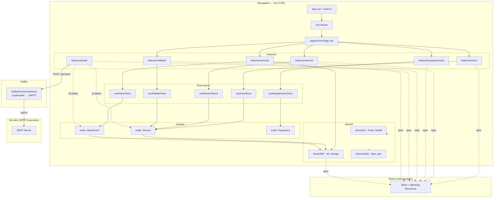

# Target Architecture

> Arquitetura alvo do sistema novo, respeitando o paradigma escolhido em `paradigm_decision.md` (Opção 1 — Component-based reativo / Transformacional) e a topologia escolhida em `topology_decision.md` (Feature-Sliced Design simplificado).

## Visão geral

O sistema novo é uma SPA **Vue 3 + Vite + TypeScript** com topologia **Feature-Sliced Design (FSD)**. O frontend consome uma única Netlify Function para envio de email via SMTP, mantendo persistência local em IndexedDB (v3, stores `records` + `attachments`). A arquitetura é component-based reativa: cada feature é um módulo FSD com seus próprios componentes Vue, store Pinia e tipos TypeScript. Não há backend próprio — a única função serverless faz relay SMTP. O banco é client-side (IndexedDB), sem servidor de dados.

## Diagrama (Mermaid)



## Componentes

| Componente | Tipo | Responsabilidade | Origem |
|---|---|---|---|
| `app/App.vue` + `app/main.ts` | App shell | Bootstrap da aplicação Vue + router + providers | `scripts/app.js` (transformado) |
| `pages/FormPage.vue` | Página | Layout SPA com 5 seções visíveis | `index.html` + `scripts/app.js` layout |
| `features/inicio/` | Feature | Renderização + validação dos 12 campos iniciais | `scripts/iniciais.js` + `scripts/fields.js` (parcial) |
| `features/retorno/` | Feature | Campos dinâmicos por tipo de ordem, condicionais | `scripts/retornos.js` + `scripts/fields.js` (parcial) |
| `features/equipamentos/` | Feature | CRUD de equipamentos na sessão | `scripts/equipment.js` |
| `features/anexos/` | Feature | Upload, compressão, preview de anexos | `scripts/attachments.js` + `scripts/compress.js` |
| `features/email/` | Feature | Composição e envio de email (frontend) | `scripts/email.js` + `scripts/send.js` |
| `features/sidebar/` | Feature | Sidebar com lista de registros + CRUD | `scripts/sidebar.js` |
| `entities/record/` | Entity | Interface Record + IndexedDB CRUD | `scripts/db.js` + `scripts/persistence.js` + `scripts/restore.js` |
| `entities/attachment/` | Entity | Interface Attachment + IndexedDB CRUD | `scripts/db.js` + `scripts/attachments.js` |
| `entities/equipment/` | Entity | Interface Equipment | `scripts/equipment.js` |
| `shared/lib/` | Lib | db.ts, storage.ts, compress.ts (lógica pura) | `scripts/db.js`, `scripts/storage.js` |
| `shared/ui/` | UI kit | Toast, Modal, ErrorBar como componentes Vue | `scripts/ui.js` |
| `shared/utils/` | Utils | formatDate, geoLocation, base64 | `scripts/utils.js` |
| `netlify/functions/send.ts` | Serverless | Relay SMTP via nodemailer | `netlify/functions/send.js` (port TS) |

## Bounded contexts

### BC-01: Início (features/inicio/)
- **Responsabilidade**: Renderizar 12 campos fixos (UC, OS, tipo-ordem, parceiro-lider, municipio, placa, data, hora-inicio, hora-fim, coordenadas, notificado, complemento). Validar campos obrigatórios no blur. Gerenciar placeholder "Selecione" em selects.
- **Justificativa do agrupamento / separação**: Agrupa todos os campos iniciais que são independentes do tipo de ordem. Separado de retorno porque muda em frequência diferente (retorno muda por tipo de ordem).
- **Componentes internos**: `InicioForm.vue`, `CampoInicio.vue`, `GeolocationButton.vue`
- **Store**: `useInicioStore` (Pinia)

### BC-02: Retorno (features/retorno/)
- **Responsabilidade**: Renderizar campos dinâmicos conforme tipo de ordem (41 tipos, ~200+ campos no total). Avaliar condições de visibilidade (condicionais com string/array/negação). Zerar valor de campos ocultos. Gerenciar transição ao mudar tipo de ordem.
- **Justificativa do agrupamento / separação**: A lógica de campos condicionais é complexa e específica — merece contexto próprio. Separado de Início porque responde a mudanças de tipo de ordem.
- **Componentes internos**: `RetornoForm.vue`, `CampoRetorno.vue`, `CondicionalWrapper.vue`
- **Composable**: `useConditionalFields()` (lógica pura de avaliação condicional)
- **Store**: `useRetornoStore` (Pinia)

### BC-03: Equipamentos (features/equipamentos/)
- **Responsabilidade**: CRUD de equipamentos na sessão (status, categoria, número). Validação de unicidade de número.
- **Justificativa do agrupamento / separação**: Entidade separada com ciclo de vida próprio (não depende de tipo de ordem). Compartilha apenas o Record aggregate.
- **Componentes internos**: `EquipamentoForm.vue`, `EquipamentoLista.vue`, `EquipamentoRow.vue`
- **Store**: `useEquipamentoStore` (Pinia)

### BC-04: Anexos (features/anexos/)
- **Responsabilidade**: Upload, compressão progressiva (canvas API), preview, remoção de anexos. Limite 12x8MB.
- **Justificativa do agrupamento / separação**: Lógica de compressão de imagens é complexa e isolada (até 10 tentativas). Store separado do Record no IndexedDB.
- **Componentes internos**: `AnexoUpload.vue`, `AnexoPreview.vue`, `AnexoLista.vue`
- **Composable**: `useImageCompression()`
- **Store**: `useAnexoStore` (Pinia)

### BC-05: Email (features/email/)
- **Responsabilidade**: Compor corpo do email (texto plano, datas invertidas, normalização). Orquestrar envio via POST para Netlify Function. Gerenciar confirmação de reenvio (registros já enviados).
- **Justificativa do agrupamento / separação**: Composição de email é um pipeline de transformação de dados — isolável e testável sem UI.
- **Composable**: `useComposeEmail()` → função pura `composeEmail(data): { subject, text }`
- **Store**: Compartilha dados de outras stores (não tem store própria)

### BC-06: Sidebar (features/sidebar/)
- **Responsabilidade**: Listar registros ordenados por data (mais recente primeiro). Filtrar por período (manhã/tarde/noite). Busca textual em todos os campos. Duplicar, excluir e restaurar registros completos (dados + anexos).
- **Justificativa do agrupamento / separação**: Funcionalidade de histórico com UI própria e store separada. Opera sobre os mesmos dados de `entities/record/` mas com perspectiva diferente.
- **Componentes internos**: `SidebarPanel.vue`, `SidebarLista.vue`, `SidebarFiltro.vue`, `SidebarItem.vue`, `SidebarSearch.vue`
- **Store**: `useSidebarStore` (Pinia)

### BC-07: Compartilhado (shared/)
- **Responsabilidade**: Componentes de UI reutilizáveis (Toast, Modal, ErrorBar), lógica de banco (IndexedDB CRUD), storage (localStorage backup), utilitários (formatação de data, geolocalização, base64), tipos globais.
- **Justificativa do agrupamento / separação**: Código que não pertence a nenhuma feature específica nem a nenhuma entidade — compartilhado entre múltiplos contexts.
- **Componentes**: `BaseToast.vue`, `BaseModal.vue`, `BaseErrorBar.vue`
- **Lib**: `db.ts`, `storage.ts`, `compress.ts`
- **Utils**: `formatDate.ts`, `geoLocation.ts`, `base64.ts`

## Decisões arquiteturais (ADR-style resumido)

### AD-01: Feature-Sliced Design como topologia
- **Decisão**: Adotar FSD simplificado com 6 features + entities + shared
- **Alternativas descartadas**: Monolito flat (legado), Package-by-feature sem camadas
- **Justificativa**: Maximiza isolamento entre features, barreiras de dependência naturais, composição com Vue 3 + TypeScript
- **Rastreabilidade**: `topology_decision.md` — Opção 2

### AD-02: Pinia como gerenciamento de estado
- **Decisão**: Cada feature tem sua própria store Pinia; não há store global único
- **Alternativas descartadas**: Vuex, store global única (como state.js legado)
- **Justificativa**: Isolamento de responsabilidade; cada store gerencia apenas seu domínio; comunicação entre stores via actions, não mutação direta
- **Rastreabilidade**: `paradigm_decision.md` — Implicação 2 (estado global → stores reativas)

### AD-03: Zod + VeeValidate para validação
- **Decisão**: Schemas Zod definem regras de negócio; VeeValidate gerencia blur/input no template
- **Alternativas descartadas**: Validação procedural manual (legado), validação inline nos componentes
- **Justificativa**: Regras de negócio declarativas, tipadas, testáveis sem DOM; VeeValidate elimina boilerplate de blur/error class
- **Rastreabilidade**: `paradigm_decision.md` — Implicação 3; `target_business_rules.md` BR-MIGRAR-026 a BR-MIGRAR-036

### AD-04: Template refs no lugar de DOM cache
- **Decisão**: Usar `ref` e `template refs` do Vue; não existe `dom.js`
- **Alternativas descartadas**: Cache manual de elementos (legado com `getElementById`)
- **Justificativa**: Vue gerencia referências automaticamente; sem risco de referência órfã após re-render
- **Rastreabilidade**: `paradigm_decision.md` — Implicação 1; `discard_log.md` BR-DESCARTAR-001

### AD-05: Testes co-localizados por feature
- **Decisão**: Cada feature tem seus próprios testes `.test.ts` na mesma pasta
- **Alternativas descartadas**: Pasta `tests/` centralizada (legado)
- **Justificativa**: Co-localização facilita manutenção; cada teste importa apenas o que precisa da feature
- **Rastreabilidade**: `target_business_rules.md` — padrão de teste

### AD-06: Netlify Function mantida como serverless, portada para TS
- **Decisão**: `send.js` vira `send.ts`, com `composeEmail()` extraída como função pura testável
- **Alternativas descartadas**: Backend Node.js dedicado, API Gateway
- **Justificativa**: Manter deploy zero-config; separação de `comporEmail()` permite testar lógica de composição sem SMTP
- **Rastreabilidade**: `migration_strategy.md` — Big Bang; BR-HUMANA-002 (Opção C)

## Honra ao paradigma escolhido

- **Paradigma alvo**: Component-based com Reatividade Declarativa (Vue 3 + Composition API)
- **Como a arquitetura honra esse paradigma**:
  1. **Manipulação DOM → Templates declarativos**: Todos os campos de formulário são componentes Vue SFC com `v-for`, `v-model`, `v-if`. Zero `innerHTML` ou `createElement`. `dom.js` não existe.
  2. **Estado global mutável → Stores reativas Pinia**: Cada feature tem store própria com `state()`, `getters`, `actions`. Não há objeto `state` global mutável. Mutações são explícitas via actions.
  3. **Validação procedural → Schemas Zod declarativos**: Regras de validação são definidas como schemas Zod. VeeValidate conecta os schemas ao template. `validation.js` (251 LOC, complexidade 8.4) é eliminado.
  4. **Event listeners manuais → Event bindings do Vue**: `@change`, `@input`, `@blur` nos templates. Zero `addEventListener`. Sem vazamento de listeners.
  5. **Renderização por innerHTML → Componentes dinâmicos**: `INPUT_CREATORS` vira `<component :is="campoComponent(field.tipo)">`. Campos condicionais usam `<component :is="...">` + `v-if`.

## Honra à topologia escolhida

- **Topologia escolhida**: Feature-Sliced Design simplificado (Opção 2)
- **Como a arquitetura materializa essa topologia**:
  - Cada feature FSD (`features/inicio/`, `features/retorno/`, etc.) é um bounded context com seus próprios componentes, composables e store
  - As camadas `entities/`, `shared/` e `app/` são separadas por responsabilidade
  - Features não importam diretamente de outras features — comunicação via `entities/` e `shared/`
  - A árvore de pastas final segue exatamente o esboço registrado em `topology_decision.md`
- **Árvore alvo**:
  ```
  src/
  ├── app/
  ├── pages/
  ├── features/
  │   ├── inicio/
  │   ├── retorno/
  │   ├── equipamentos/
  │   ├── anexos/
  │   ├── email/
  │   └── sidebar/
  ├── entities/
  │   ├── record/
  │   ├── attachment/
  │   └── equipment/
  └── shared/
      ├── ui/
      ├── lib/
      ├── utils/
      └── types/
  ```

## Bordas com o legado durante a migração

- Estratégia Big Bang: não há operação simultânea de legado e novo.
- O novo sistema substitui o deploy do legado em um único commit.
- Rollback: 1 clique no Netlify para reverter ao deploy anterior (legado).
- IndexedDB v3 legado tem schema compatível com v4 — registros existentes são mantidos.
- Nenhuma borda de compatibilidade retroativa é necessária durante a migração.

## Notas
- A função `netlify/functions/send.ts` é o único componente que não segue FSD — permanece como serverless function na raiz do projeto, por exigência do Netlify Functions.
- Service Worker migrado de manual para vite-plugin-pwa + Workbox, que gera `sw.js` automaticamente.
- Tailwind CSS mantido via PostCSS, sem mudanças na configuração básica.
- 334 testes legados serão reescritos como ~250-300 testes Vitest + @testing-library/vue, co-localizados por feature.
