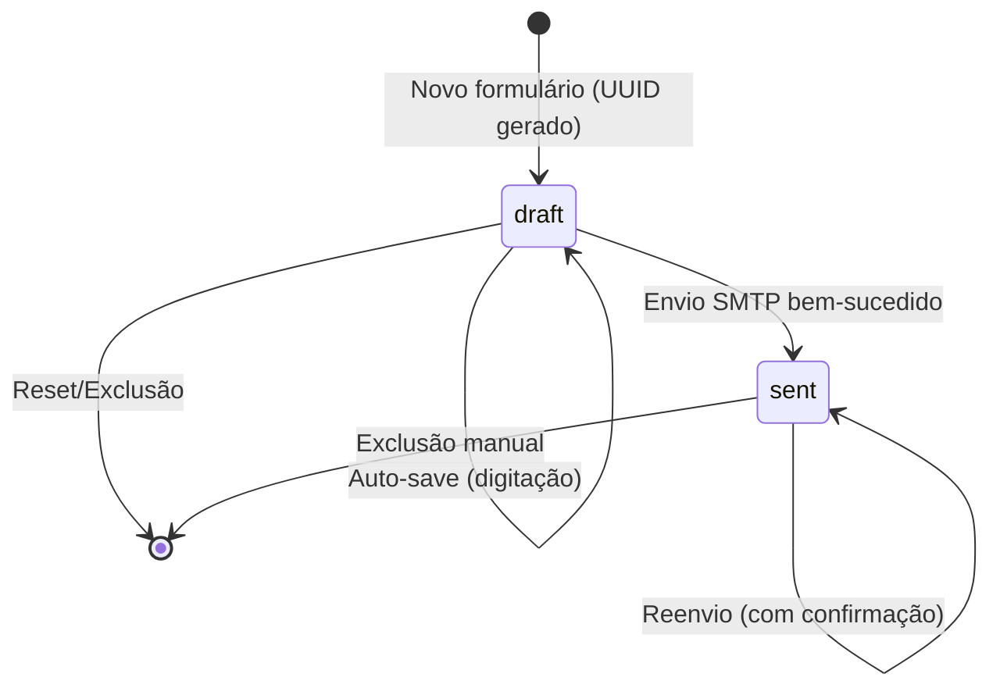
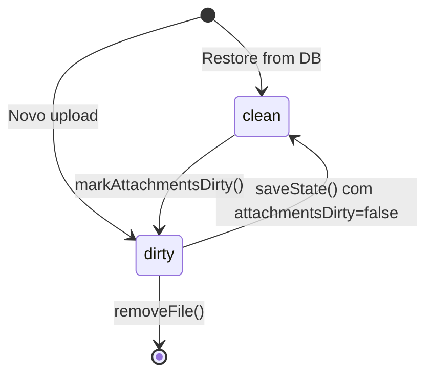
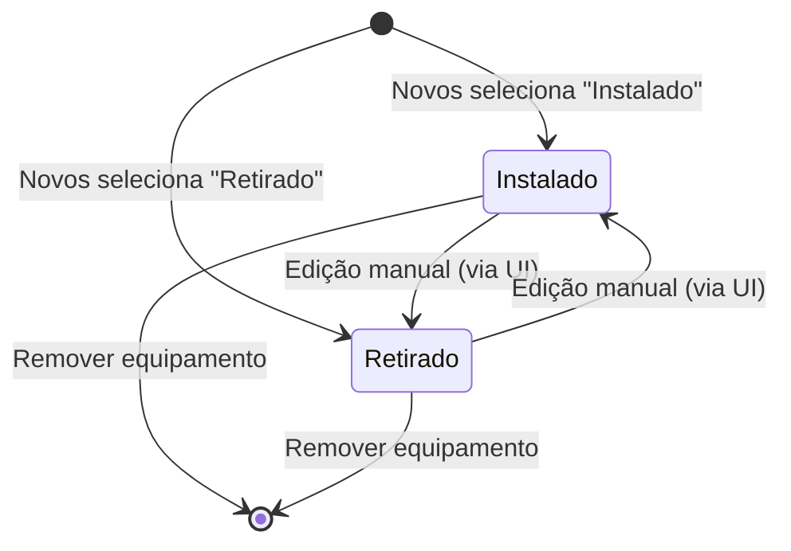
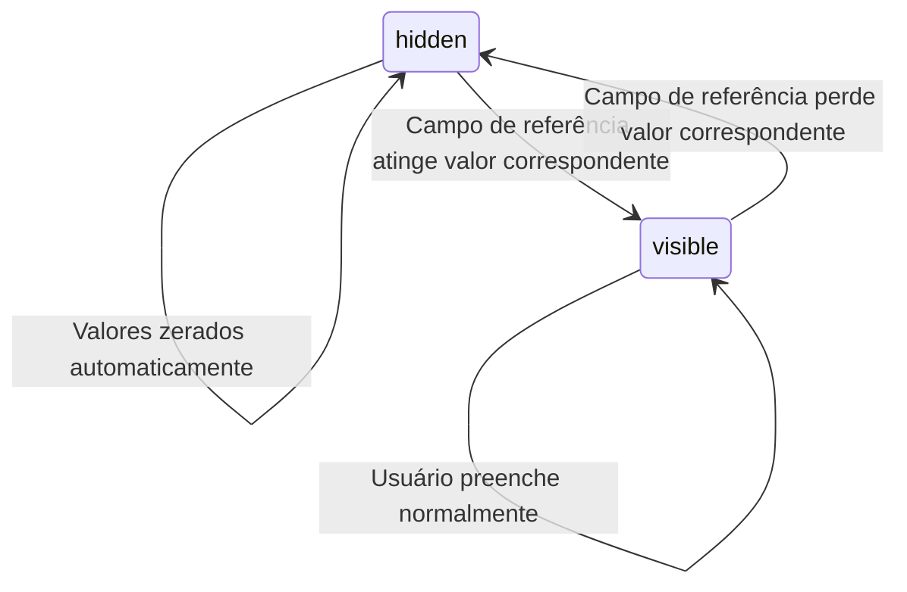

# State Machines — mail-mvp

> Gerado pelo Detetive em 2026-06-15
> Escala: 🟢 CONFIRMADO | 🟡 INFERIDO | 🔴 LACUNA

---

## 1. Record (Registro de OS)

Entidade central. Todo formulário preenchido vira um `Record` no IndexedDB com um ciclo de vida simples de dois estados.

### Máquina de Estados

### Transições

| De | Para | Gatilho | Ação | Confiança |
|----|------|---------|------|-----------|
| `[*]` | `draft` | Novo formulário OU click "Novo Formulário" | Gera UUID, salva estado inicial vazio | 🟢 CONFIRMADO |
| `draft` | `draft` | Input do usuário | Auto-save com debounce de 1000ms | 🟢 CONFIRMADO |
| `draft` | `sent` | Click "Enviar" → validação OK → fetch("/api/send") → 200 | `updateRecordStatus(uuid, { sentAt, ... })`, toast verde | 🟢 CONFIRMADO |
| `sent` | `sent` | Click "Enviar" → modal confirmação → OK → reenvio | Re-envio SMTP com mesmo UUID | 🟢 CONFIRMADO |
| `draft`/`sent` | `[*]` | Exclusão na sidebar | `deleteRecord()` atômico (record + attachments) | 🟢 CONFIRMADO |
| `draft`/`sent` | `[*]` | Click "Novo Formulário" | `clearCurrentUUID()` + reset do DOM | 🟢 CONFIRMADO |

### Estados

| Estado | Descrição | Pode enviar? | Pode editar? | Pode excluir? |
|--------|-----------|:---:|:---:|:---:|
| `draft` | Rascunho — nunca enviado | ✅ Sim | ✅ Sim | ✅ Sim |
| `sent` | Já enviado — reenvio requer confirmação | ✅ Sim (com aviso) | ❌ Não (formulário carrega read-only de fato) | ✅ Sim |

> 🟡 INFERIDO: Registros "sent" carregam no formulário mas não há proteção explícita contra edição — a edição é possível tecnicamente e o status `sent` só impede reenvio sem confirmação através do modal.

---

## 2. Anexo (Attachment)

Anexos seguem estados implícitos via dirty tracking:

| Estado | Significado | Confiança |
|--------|-------------|-----------|
| `dirty` | Anexos foram modificados desde último save — precisam ser re-serializados e persistidos | 🟢 CONFIRMADO |
| `clean` | Anexos em memória correspondem ao que está no IndexedDB | 🟢 CONFIRMADO |

---

## 3. Equipamento (In-memory)

Equipamentos são entidades sem estado persistente próprio — existem apenas dentro do `state.equipamentos[]`. Cada equipamento tem um par `status` (Instalado/Retirado) que não representa estado do sistema, mas sim uma **classificação da ação executada** no equipamento.

> 🟢 CONFIRMADO: O campo `status` do equipamento é um select editável — pode ser alterado livremente.

---

## 4. Campos Condicionais (Retorno)

Os campos de Retorno têm visibilidade controlada por uma máquina de estados implícita:

| Estado | Display | Valor | Confiança |
|--------|---------|-------|-----------|
| `visible` | `display: ""` (normal) | Mantido | 🟢 CONFIRMADO |
| `hidden` | `display: "none"` | Zerado (setado para "") | 🟢 CONFIRMADO |

> 🟢 CONFIRMADO: Transição `visible→hidden` zera o valor do campo (`retornos.js:116-117`).

---

## Resumo

| Máquina | Estados | Transições | Confiança |
|---------|---------|------------|-----------|
| Record | 2 (draft, sent) | 5 | 🟢 |
| Attachment | 2 (dirty, clean) | 4 | 🟢 |
| Equipment Status | 2 (Instalado, Retirado) | 4 | 🟢 |
| Conditional Field | 2 (visible, hidden) | 2 | 🟢 |

---

*Fim do documento de máquinas de estado.*
